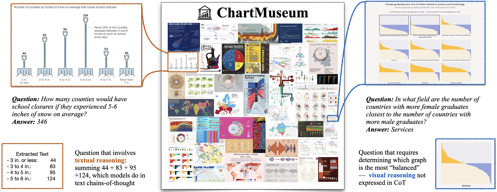
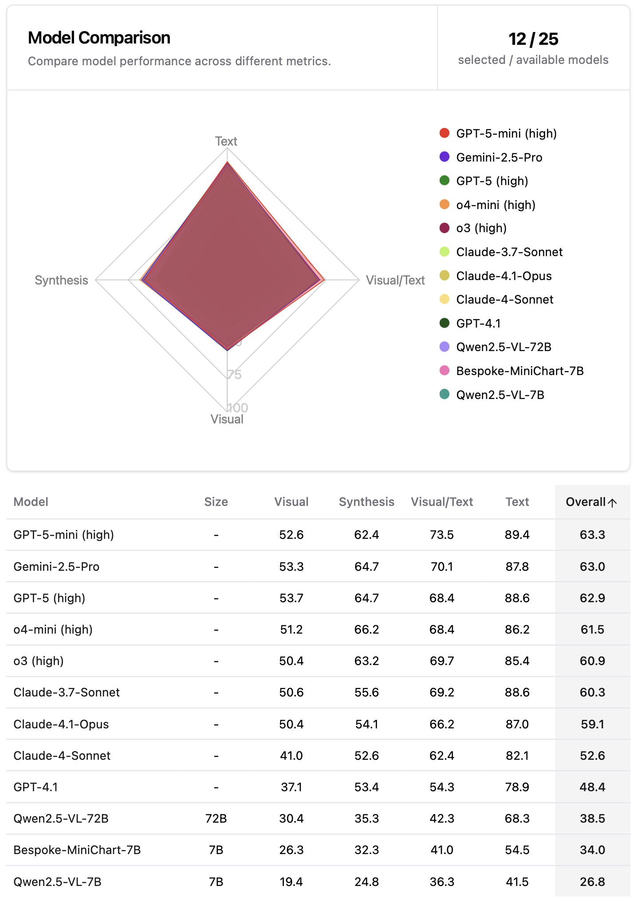

# [NeurIPS 2025] ChartMuseum: Testing Visual Reasoning Capabilities of Large Vision-Language Models

Authors: Liyan Tang, Grace Kim, Xinyu Zhao, Thom Lake, Wenxuan Ding, Fangcong Yin, Prasann Singhal, Manya Wadhwa, Zeyu Leo Liu, Zayne Sprague, Ramya Namuduri, Bodun Hu, Juan Diego Rodriguez, Puyuan Peng, Greg Durrett

[Leaderboard](https://chartmuseum-leaderboard.github.io) 🥇 | [Benchmark](https://huggingface.co/datasets/lytang/ChartMuseum) 🤗 | [Paper](https://arxiv.org/abs/2505.13444) 📃


## Overview

**ChartMuseum** is a chart question answering benchmark designed to evaluate reasoning capabilities of large vision-language models
(LVLMs) over real-world chart images. The benchmark consists of 1162 *(image, question, short answer)* tuples and exclusively targets at questions that requires non-trivial textual and visual reasoning skills. The dataset is collectively annotated by a team of 13 researchers in computer science.

<p align="center">
    
</p>


## Installation

To set up the environment for accessing the dataset and evaluating model performance, follow these steps:

```bash
# Create and activate a new conda environment
conda create -n chartmuseum python=3.11
conda activate chartmuseum

# Clone the repository
git clone https://github.com/Liyan06/ChartMuseum.git
cd chartmuseum

# Install dependencies
pip install -r requirements.txt
```


## Benchmark Access

[Our benchmark is available](https://huggingface.co/datasets/lytang/ChartMuseum) at Hugging Face 🤗. The following code snippet shows how to access the benchmark. Note that in addition to loading the dataset, you need to download the `images/` [folder](https://huggingface.co/datasets/lytang/ChartMuseum/tree/main/images) from our Hugging Face repo.


```python
from datasets import load_dataset
from huggingface_hub import snapshot_download

# download the dataset
dataset = load_dataset("lytang/ChartMuseum")

# download the images
snapshot_download(
    repo_id="lytang/ChartMuseum",
    repo_type="dataset",
    allow_patterns="images/*",
    local_dir="." # Specify the local directory where you want to save the images
)
```

The benchmark contains the following fields:
|Field| Description |
|--|--|
|image| an image where the question is based on|
|question| a question on an image|
|answer| an answer to a question|
|reasoning_type| the reasoning skill that is primarily required to answer the question - *text*, *visual/text*, *synthesis*, *visual*|
|source| the website where we collect the image |
|hash| a unique identifier for the example |

The question answering prompt we used for all models is included in [prompt.py](prompt.py).

## Performance on ChartMuseum

Human overall accuracy on ChartMuseum is **93%**, with **98.2%** on the visual reasoning questions.

<p align="center">
    
</p>


## Output Evaluation Instruction

Once your model predictions on the benchmark are ready, we provide an evaluation script to compute the accuracy of model answers, which is very simple to run. We use `gpt-4.1-mini-2025-04-14` checkpoint from OpenAI as the LLM-as-a-Judge model for our benchmark. Make sure to set up your OpenAI API key in your environment variables.


```bash
export OPENAI_API_KEY=your_api_key_here
python evaluate.py --prediction_path /path/to/predictions.json --split dev/test
```

Optionally, you can specify `--save_dir /path/to/save_dir` to save the evaluation results. The evaluation script will extract the short answers from predictions and compare them with the ground truth answers. The evaluation script will output:
* The cost and time spent on the evaluation. The estimated cost is \$0.03 and \$0.16 on dev and test set, respectively. The evaluation typically takes around 5s for the dev set and 12s for the test set.
* The accuracy of the model on the dev/test set.


> [!IMPORTANT]
> The prediction file should contain a list of strings, where each string correpsonds to an answer of a question in the dataset. The order of the answers should match the order of the questions in the dataset. Note that we require each string to contain a *short answer* wrapped in the `<answer></answer>` tags, as our evaluation script will automatically extract the short answer from the string.

```
[
    "...<answer>predicted short answer 1</answer>...",
    "...<answer>predicted short answer 2</answer>...",
    ...
]
```

### Evaluation Demo

To demonstrate the evaluation process, we'll use outputs from Claude-3.7-Sonnet on the dev set. The example below shows how to run the evaluation with our provided [example_outputs](example_outputs) (both formatting styles are supported):

```bash
export OPENAI_API_KEY=your_api_key_here
python evaluate.py \
    --prediction_path example_outputs/claude-3-7-sonnet-20250219-dev-full-output.json \
    --split dev
```

<details>
<summary>Expected Output (shortened)</summary>

```
━━━━━━━━━━━━━━━━━━━━━━━━━━━━━━━━━━━━━━━━━━━━━━━━━━━━━━━━━━━━━━━━━━━━━━━━━━━━━━━━━━ 100% • Time Elapsed 0:00:05 • Time Remaining 0:00:00                                     
Requests: Total: 162 • Cached: 0✓ • Success: 162✓ • Failed: 0✗ • In Progress: 0⋯ • Req/min: 1703.1 • Res/min: 1703.1                                                    
                Final Curator Statistics                
╭────────────────────────────┬─────────────────────────╮
│ Section/Metric             │ Value                   │
├────────────────────────────┼─────────────────────────┤
│ Model                      │                         │
│ Name                       │ gpt-4.1-mini-2025-04-14 │
│ Rate Limit (RPM)           │ 12000                   │
│ Rate Limit (TPM)           │ 4000000                 │
│ Requests                   │                         │
│ Total Processed            │ 162                     │
│ Successful                 │ 162                     │
│ Failed                     │ 0                       │
│ Tokens                     │                         │
│ Total Tokens Used          │ 0                       │
│ Total Input Tokens         │ 0                       │
│ Total Output Tokens        │ 0                       │
│ Average Tokens per Request │ 0                       │
│ Average Input Tokens       │ 0                       │
│ Average Output Tokens      │ 0                       │
│ Costs                      │                         │
│ Total Cost                 │ $0.027                  │
│ Average Cost per Request   │ $0.000                  │
│ Input Cost per 1M Tokens   │ $0.400                  │
│ Output Cost per 1M Tokens  │ $1.600                  │
│ Performance                │                         │
│ Total Time                 │ 5.71s                   │
│ Average Time per Request   │ 0.04s                   │
│ Requests per Minute        │ 1700.9                  │
│ Responses per Minute       │ 1700.9                  │
│ Max Concurrent Requests    │ 35                      │
│ Input Tokens per Minute    │ 0.0                     │
│ Output Tokens per Minute   │ 0.0                     │
╰────────────────────────────┴─────────────────────────╯
Final Accuracy: 0.6296
```
</details>

The inference time with our evaluation script takes 5s and 12s for the dev and test set, respectively.


## License

Our benchmark is licensed under [CC BY-SA 4.0](https://creativecommons.org/licenses/by-sa/4.0/deed.en). Copyright of all included charts is retained by their original authors and sources. Our code is licensed under [Apache 2.0](LICENSE).

## Citation

If you found our work useful, please consider citing our work.

```bibtex
@misc{tang2025chartmuseum,
      title={ChartMuseum: Testing Visual Reasoning Capabilities of Large Vision-Language Models}, 
      author={Liyan Tang and Grace Kim and Xinyu Zhao and Thom Lake and Wenxuan Ding and Fangcong Yin and Prasann Singhal and Manya Wadhwa and Zeyu Leo Liu and Zayne Sprague and Ramya Namuduri and Bodun Hu and Juan Diego Rodriguez and Puyuan Peng and Greg Durrett},
      year={2025},
      eprint={2505.13444},
      archivePrefix={arXiv},
      primaryClass={cs.CL},
      url={https://arxiv.org/abs/2505.13444}, 
}
```